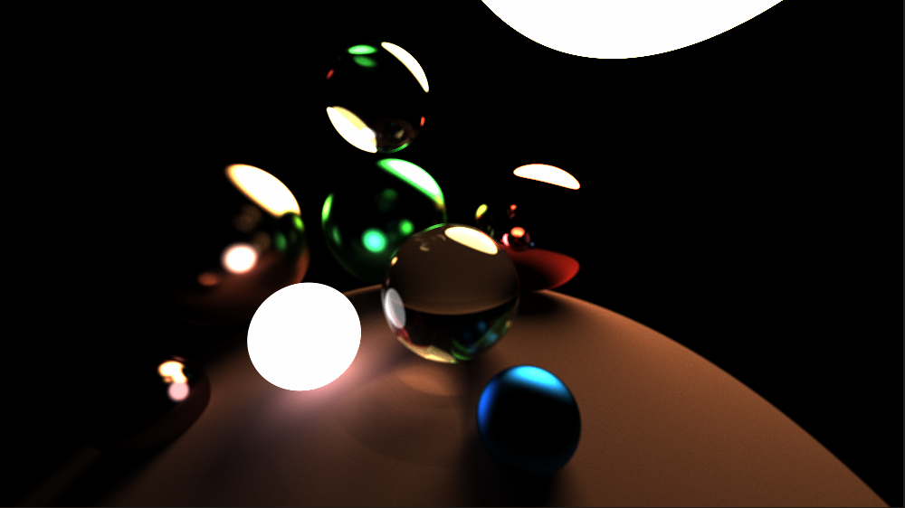
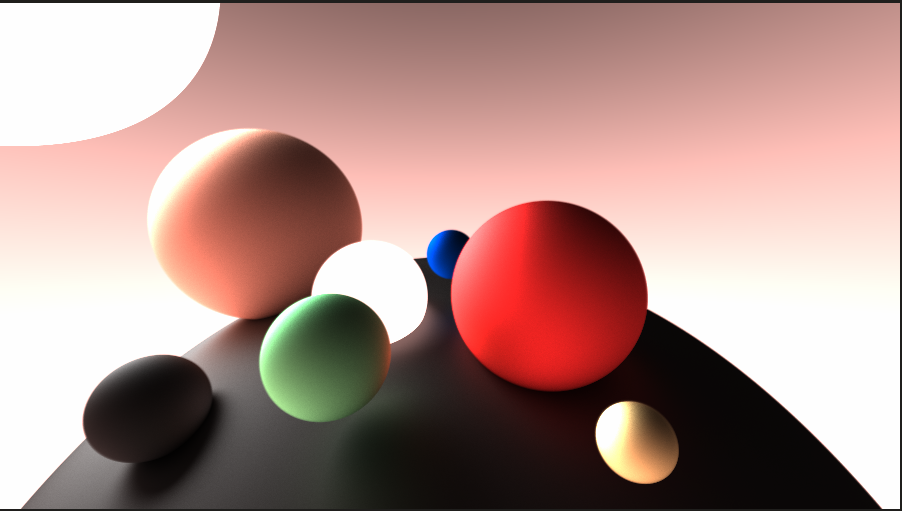

# rust-tracer
simple ray tracer written in Rust using SDL2 as renderer [WIP]
## build
clone the repo then build and run the project using `cargo build --release && cargo run --release`
## some pics

    
    

<p1 float="right"></p1>
    

